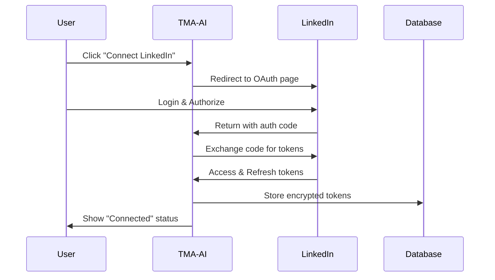

# Complete OAuth Setup Guide for TMA-AI

## Overview

TMA-AI uses OAuth 2.0 authentication for ALL platform integrations. This means:
- ✅ No manual API keys required
- ✅ Users click "Connect" and authorize via platform login
- ✅ Secure token storage in database
- ✅ Automatic token refresh when needed

## How OAuth Works in TMA-AI



## Quick Setup Steps

### 1. Environment Setup
```bash
# Copy environment template
cp .env.example .env

# Edit .env and add your OAuth credentials
nano .env
```

### 2. Add OAuth Credentials
For each platform you want to enable, add the Client ID and Secret to `.env`:

```env
# Example: LinkedIn
LINKEDIN_CLIENT_ID=86vhj2q7ukf83q
LINKEDIN_CLIENT_SECRET=WPL_AP1.cY8kGzXz.MzQ5NjI0Ng==
```

### 3. Platform Automatically Appears
Once credentials are added, the platform will automatically show up in the integrations page!

## Platform-Specific Setup

### Meta (Facebook & Instagram)

**Developer Portal:** https://developers.facebook.com/

1. Create a new app (Business type)
2. Add Facebook Login product
3. Settings → Basic → Add Platform → Website
4. Valid OAuth Redirect URIs:
   ```
   http://localhost:3000/api/integrations/callback
   https://yourdomain.com/api/integrations/callback
   ```
5. Request permissions in App Review:
   - pages_show_list
   - pages_messaging
   - pages_read_engagement
   - pages_manage_posts
   - instagram_basic
   - instagram_content_publish
   - ads_management

**Environment Variables:**
```env
META_CLIENT_ID=your_app_id
META_CLIENT_SECRET=your_app_secret
```

### Google Services (Ads, Analytics, YouTube)

**Developer Portal:** https://console.cloud.google.com/

1. Create new project or select existing
2. Enable APIs:
   - Google Ads API
   - Google Analytics API
   - YouTube Data API v3
3. Create OAuth 2.0 credentials (Web application)
4. Authorized redirect URIs:
   ```
   http://localhost:3000/api/integrations/callback
   https://yourdomain.com/api/integrations/callback
   ```

**Environment Variables (use same for all Google services):**
```env
GOOGLEADS_CLIENT_ID=xxxxx.apps.googleusercontent.com
GOOGLEADS_CLIENT_SECRET=GOCSPX-xxxxx
GOOGLEANALYTICS_CLIENT_ID=xxxxx.apps.googleusercontent.com
GOOGLEANALYTICS_CLIENT_SECRET=GOCSPX-xxxxx
YOUTUBE_CLIENT_ID=xxxxx.apps.googleusercontent.com
YOUTUBE_CLIENT_SECRET=GOCSPX-xxxxx
```

### LinkedIn

**Developer Portal:** https://www.linkedin.com/developers/

1. Create app
2. Auth tab → Add redirect URL:
   ```
   http://localhost:3000/api/integrations/callback
   ```
3. Products tab → Request access:
   - Sign In with LinkedIn using OpenID Connect
   - Share on LinkedIn
   - Marketing Developer Platform

**Environment Variables:**
```env
LINKEDIN_CLIENT_ID=86vhj2q7ukf83q
LINKEDIN_CLIENT_SECRET=WPL_AP1.xxxxx
```

### Twitter/X

**Developer Portal:** https://developer.twitter.com/

1. Create Project and App
2. User authentication settings:
   - Enable OAuth 2.0
   - Type: Web App
   - Callback URLs:
     ```
     http://localhost:3000/api/integrations/callback
     ```
   - Required scopes: tweet.read, tweet.write, users.read, offline.access

**Environment Variables:**
```env
TWITTER_CLIENT_ID=M1M5R0RYUEgxbDNKOHcxaEdoMko6MTpjaQ
TWITTER_CLIENT_SECRET=xxxxx
```

### TikTok

**Developer Portal:** https://developers.tiktok.com/

1. Create app
2. Add Redirect URI:
   ```
   http://localhost:3000/api/integrations/callback
   ```
3. Request scopes:
   - user.info.basic
   - video.list
   - video.publish

**Environment Variables:**
```env
TIKTOK_CLIENT_ID=awx9y5h3n7b8c9d0
TIKTOK_CLIENT_SECRET=xxxxx
```

### Pinterest

**Developer Portal:** https://developers.pinterest.com/

1. Create app
2. Configure OAuth:
   - Redirect URIs:
     ```
     http://localhost:3000/api/integrations/callback
     ```

**Environment Variables:**
```env
PINTEREST_CLIENT_ID=1234567
PINTEREST_CLIENT_SECRET=xxxxx
```

### Mailchimp

**Developer Portal:** https://mailchimp.com/developer/

1. Register application
2. Redirect URI:
   ```
   http://localhost:3000/api/integrations/callback
   ```

**Environment Variables:**
```env
MAILCHIMP_CLIENT_ID=123456789
MAILCHIMP_CLIENT_SECRET=xxxxx
```

### HubSpot

**Developer Portal:** https://developers.hubspot.com/

1. Create app
2. Auth settings:
   - Redirect URLs:
     ```
     http://localhost:3000/api/integrations/callback
     ```
3. Scopes:
   - crm.objects.contacts.read/write
   - content
   - forms

**Environment Variables:**
```env
HUBSPOT_CLIENT_ID=xxxxxxxx-xxxx-xxxx-xxxx-xxxxxxxxxxxx
HUBSPOT_CLIENT_SECRET=xxxxxxxx-xxxx-xxxx-xxxx-xxxxxxxxxxxx
```

## Testing the OAuth Flow

### 1. Start Development Server
```bash
npm run dev
```

### 2. Navigate to Integrations
Go to: http://localhost:3000/dashboard/integrations

### 3. Test Connection
1. Click on any configured platform
2. You'll be redirected to the platform's OAuth page
3. Login and authorize
4. You'll be redirected back with "Connected" status

### 4. Check Database
Tokens are stored in the `integrations` table:
```sql
SELECT platform, created_at FROM integrations WHERE user_id = ?;
```

## OAuth Flow Details

### 1. User Initiates Connection
- User clicks "Connect" button for a platform
- Frontend calls `/api/integrations/connect`

### 2. Generate Authorization URL
```typescript
// /api/integrations/connect/route.ts
const authUrl = generateAuthorizationUrl(platform, redirectUri, state);
```

### 3. User Authorizes
- User is redirected to platform's OAuth page
- User logs in and approves permissions
- Platform redirects to callback URL with authorization code

### 4. Handle Callback
```typescript
// /api/integrations/callback/route.ts
// Exchange authorization code for tokens
const tokens = await exchangeCodeForTokens(platform, code, redirectUri);

// Store in database
await db.insert(integrations).values({
  userId,
  platform,
  accessToken: tokens.accessToken,
  refreshToken: tokens.refreshToken,
  expiresAt,
  isActive: true,
});
```

### 5. Use Access Token
Access tokens can be used to make API calls to the platform:
```typescript
// Example: Fetch LinkedIn profile
const response = await fetch('https://api.linkedin.com/v2/me', {
  headers: {
    'Authorization': `Bearer ${accessToken}`
  }
});
```

## Security Features

1. **State Parameter**: CSRF protection using HMAC-signed state
2. **Token Encryption**: Tokens encrypted before database storage
3. **Automatic Refresh**: Expired tokens automatically refreshed
4. **Secure Sessions**: User authentication required for all operations
5. **PKCE Support**: For platforms requiring it (Twitter/X)

## Troubleshooting

### Platform Not Showing Up
- Ensure both CLIENT_ID and CLIENT_SECRET are set in `.env`
- Check console for warnings about missing credentials
- Restart dev server after adding credentials

### "Invalid redirect_uri" Error
- Ensure redirect URI matches EXACTLY (including trailing slashes)
- Common format: `http://localhost:3000/api/integrations/callback`
- Add both http (dev) and https (production) versions

### "Invalid scope" Error
- Some platforms require approval for certain scopes
- Start with basic scopes, request additional later
- Check platform documentation for available scopes

### Token Expired
- System automatically refreshes tokens when possible
- User may need to re-authenticate if refresh fails
- Check `expiresAt` field in database

## Production Deployment

### 1. Update Redirect URLs
Add production URLs to each platform:
```
https://yourdomain.com/api/integrations/callback
```

### 2. Environment Variables
Set production credentials in your hosting platform:
```bash
# Vercel
vercel env add LINKEDIN_CLIENT_ID
vercel env add LINKEDIN_CLIENT_SECRET

# Heroku  
heroku config:set LINKEDIN_CLIENT_ID=xxxxx
heroku config:set LINKEDIN_CLIENT_SECRET=xxxxx
```

### 3. Update App URL
```env
NEXT_PUBLIC_APP_URL=https://yourdomain.com
```

### 4. SSL/HTTPS Required
OAuth requires HTTPS in production for security.

## Adding New Platforms

To add a new OAuth platform:

1. **Update oauth-config.ts:**
```typescript
// Add to OAUTH_CONFIGS
newplatform: {
  clientId: '',
  clientSecret: '',
  authorizationUrl: 'https://platform.com/oauth/authorize',
  tokenUrl: 'https://platform.com/oauth/token',
  scope: ['read', 'write'],
}
```

2. **Add to PLATFORMS array:**
```typescript
{
  id: 'newplatform',
  name: 'New Platform',
  description: 'Platform description',
  icon: '🆕',
  iconColor: 'text-blue-600',
  bgColor: 'bg-blue-100',
  requiresOAuth: true,
}
```

3. **Update .env.example:**
```env
NEWPLATFORM_CLIENT_ID=your_client_id
NEWPLATFORM_CLIENT_SECRET=your_client_secret
```

## Support Resources

- **Meta/Facebook**: https://developers.facebook.com/docs/
- **Google**: https://developers.google.com/identity/protocols/oauth2
- **LinkedIn**: https://docs.microsoft.com/en-us/linkedin/
- **Twitter**: https://developer.twitter.com/en/docs/authentication
- **TikTok**: https://developers.tiktok.com/doc/
- **Pinterest**: https://developers.pinterest.com/docs/
- **Mailchimp**: https://mailchimp.com/developer/marketing/
- **HubSpot**: https://developers.hubspot.com/docs/api/oauth

## Next Steps

Once platforms are connected, you can:
- Fetch analytics data from all platforms
- Post content across multiple platforms
- Sync contacts and leads
- Monitor messages and comments
- Track campaign performance
- Generate unified reports